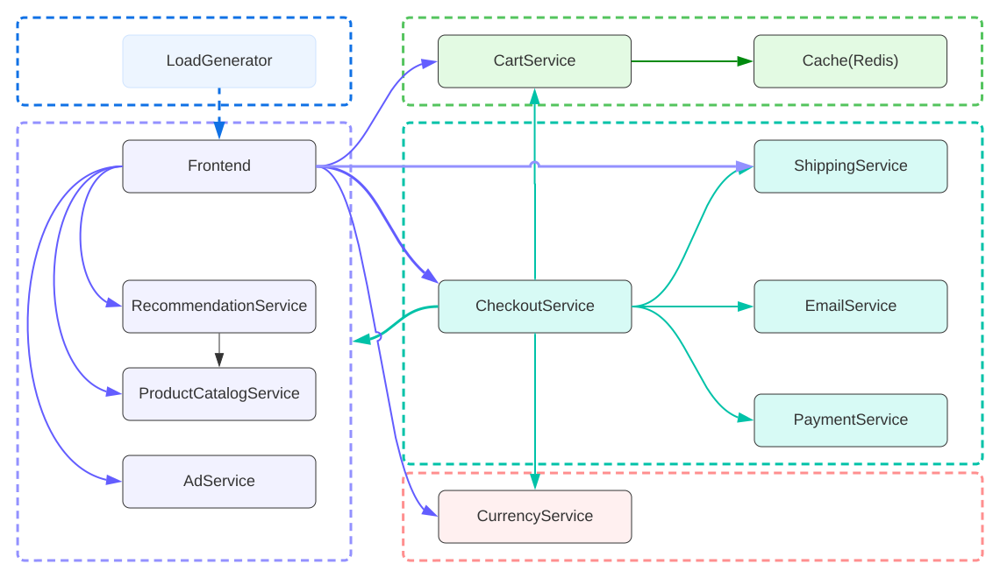

# swampUP 2022

This repository contains the resources and artifacts for our swampUP 2022 talk "Accelerating Continuous delivery with DORA, Cloud Deploy and JFrog Pipelines" on May 26th, 2022
See the [Application Repository](https://github.com/gdg-cloud-montreal/online-boutique) for application source and information
## Talk abstract

In  session, we will tell a story of an imaginary company that wants to deliver high-quality software faster to their customers, yet something is holding it back. Our imaginary company learned about DORA assessments and discovered they are a medium-level performer among similar companies in the industry. They needed to improve several things, including automating their CI and CD processes, to go to the next level.

Are you interested in learning how to use the DevOps Research and Assessment program (DORA) and new Cloud Native Solutions for CI/CD? Join our session and learn how to use the DORA program and see a demo of how managed CI/CD solutions like Google Cloud Deploy, JFrog Pipelines, and Artifactory help you implement modern microservices deployments on K8s and serverless platforms!

## Deploying the Online Boutique

Our imaginary company runs an e-commerce site, and has development teams for each of the components of the site.

This repository is structured to contain application deployment information, and the associated JFrog pipeline configurations to deploy our e-commerce application: "Online Boutique".



### Online Boutique Teams

| Team                                                                          | Description                                                                | Components                                       |
| ------------------------------------------------------------------------------| ---------------------------------------------------------------------------|--------------------------------------------------|
| [Frontend Team](./online-boutique/application-manifests/frontend)             |Responsible for the build and deployment of UI Services                     |`frontend`                                        |
| [Shopping Cart Team](./online-boutique/application-manifests/shoppingcart)    |Responsible for the build and deployment of shopping cart services.         | `cartservice`, `redis`                           |
| [Products Team](./online-boutique/application-manifests/products)             |Responsible for the build and deployment of Product Catalog services        | `productcatalogservice`, `recommendationservice` |
| [Currency Team](./online-boutique/application-manifests/currency)             |Responsible for the build and deployment of Currency Converter              |`currencyservice`                                 |
| [Checkout Team](./online-boutique/application-manifests/checkout)             |Responsible for the build and deployment of User Checkout services          |`checkoutservice`,`emailservice`,`paymentservice`,`shippingservice`  |
| [Ad Team](./online-boutique/application-manifests/ads)                        |Responsible for the build and deployment of Text based Ad services          |`adservice`                                       |
| [Loadgenerator Team ](./online-boutique/application-manifests/loadgenerator)  |Responsible for the build and deployment of synthetic load generation services. Used for Testing|`loadgenerator`                                                       |    


Each team has a Cloud Deploy pipeline for their component, that can be triggered either via an update to the associated container image(s) or to the application deployment manifests in this repository.

## Environment

Our demo environment consists of 3 [Google Kubernetes Engine (GKE) AutoPilot Clusters](https://cloud.google.com/kubernetes-engine/docs/concepts/autopilot-overview). Each cluster represents a stage in the application lifecycle:

* Development
* Staging
* Production

Instructions for deploying thes clusters can be found in the [Infrastructure Deployment README](infra/README.md#setup-dev-staging-and-production-gke-autopilot-clusters)

### Cloud Deploy Configurations

Each cluster has an associated set of configurations for Cloud Deploy, that creates the cluster deployment target. These are defined in the [infra/cloud-deploy-pipelines](infra/cloud-deploy-pipelines/) folder

**Example Cloud Deploy Target**

```yaml
apiVersion: deploy.cloud.google.com/v1
kind: Target
metadata:
  name: swampup-2022-dev-cluster
requireApproval: false
gke:
  cluster: projects/swampup-2022/locations/us-central1/clusters/dev-cluster
```

Each component, as defined in the [Online Boutique Teams](#online-boutique-teams) table, has an associated Cloud Deploy pipeline specification that defines the targets for that component and any special configurations.

**Example Cloud Deploy Pipeline**

```yaml
apiVersion: deploy.cloud.google.com/v1beta1
kind: DeliveryPipeline
metadata:
  name: swampup-2022-boutique-ads
description: Online Boutique delivery pipeline
serialPipeline:
 stages:
 - targetId: swampup-2022-dev-cluster
 - targetId: swampup-2022-stg-cluster
 - targetId: swampup-2022-prod-cluster
```

These configurations are configured in `skaffold` manifests in the [online-boutique/application-manifests](online-boutique/application-manifests/) folder. Most components are using a simple `kubectl` deployment type. 
The `frontend` component uses the `kustomize` deployment type to allow for changes to the hostname.


### JFrog Pipelines Configuration

In the [infra/jfrog-pipelines](infra/jfrog-pipelines/) folder are the configurations for the JFrog pipelines that are used to trigger the Cloud Deploy pipelines. These configurations include listners for both new container image versions and changes to the application manifests.

**Example JFrog Pipeline Resource**

```yaml
  - name: loadgeneratorservices_deployment_repo
    type: GitRepo
    configuration:
      gitProvider: source_repo
      path: gdg-cloud-montreal/swampup-2022
      buildOn:
        commit:                true
        pullRequestCreate:     true
      files:
        include: ^online-boutique\/application-manifests\/loadgenerator\/.+
```

**Example JFrog Pipeline**

```yaml
  - name: deploy_loadgenerator_pipeline
    steps:
    - name: trigger_cloud_deploy_loadgenerator
      type: bash
      configuration:
        affinityGroup: fmkGroup
        environmentVariables:
            LOADGEN_SVC_IMAGE: ${int_server_name_value}.jfrog.io/boutique/loadgenerator:${res_loadgenerator_build_info_buildNumber}
            REGION: "us-central1"
            CD_PIPELINE: "swampup-2022-boutique-loadgenerator"
        integrations: 
        #Permits access to the Artifactory Repository with our Container images      
          - name: artifactory
        # Used to authenticate with Google Cloud Platform
          - name: gcloud
        # Our JFrog Server environment
          - name: server_name
        inputResources:
        # triggers on changes to the git repository
          - name: loadgeneratorservices_deployment_repo
        # triggers on new container build information
          - name: loadgenerator_build_info
      execution:
        # Sets up execution environment for Cloud Deploy, and creates a new Release
        onStart:
          - echo "Trigger Cloud Deploy Pipeline $CD_PIPELINE"
          - export REL_TIMESTAMP=$(date '+%Y%m%d-%H%S')
          - cd $res_loadgeneratorservices_deployment_repo_resourcePath/online-boutique
          - > 
           gcloud components update --quiet 
        onExecute:
          - >
           gcloud deploy releases create loadgenerator-${REL_TIMESTAMP} 
           --delivery-pipeline $CD_PIPELINE 
           --region $REGION 
           --images=loadgenerator=$LOADGEN_SVC_IMAGE 
           --source application-manifests/loadgenerator/
```


This repository is based on the work found in [Google Cloud Platform Microservices demo repository](https://github.com/GoogleCloudPlatform/microservices-demo) 